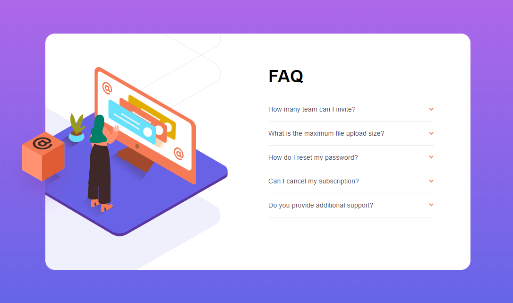
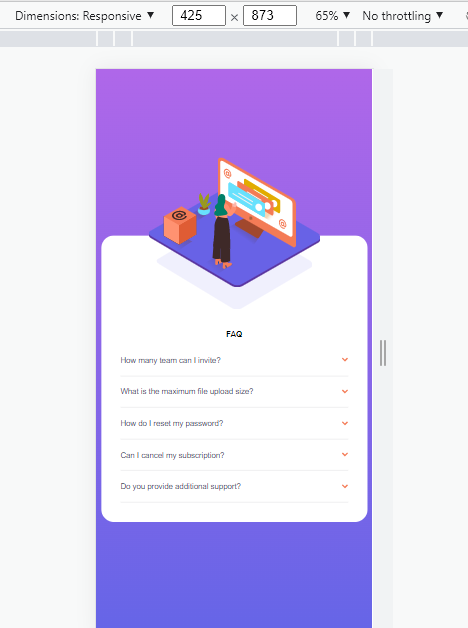

# Frontend Mentor - FAQ accordion card solution

This is a solution to the [FAQ accordion card challenge on Frontend Mentor](https://www.frontendmentor.io/challenges/faq-accordion-card-XlyjD0Oam). 

## Table of contents

- [Overview](#overview)
  - [The challenge](#the-challenge)
  - [Screenshot](#screenshot)
  - [Links](#links)
- [My process](#my-process)
  - [Built with](#built-with)
  - [What I learned](#what-i-learned)
  - [Continued development](#continued-development)
  - [Useful resources](#useful-resources)
- [Author](#author)


## Overview

### The challenge

Users should be able to:

- View the optimal layout for the component depending on their device's screen size
- See hover states for all interactive elements on the page
- Hide/Show the answer to a question when the question is clicked

### Screenshot





### Links

- Solution URL: 

## My process

### Built with

- CSS custom properties
- Flexbox
- CSS Grid
- Mobile-first workflow
- JQuery


### What I learned

I've learned how to use CSS Custom properties partially. 

Declaring global variables 
```css
:root {
	--fontSize: 12px;
	--softViolet: hsl(273, 75%, 66%);
	--softBlue: hsl(240, 73%, 65%);
	--veryDarkGrayishBlue: hsl(237, 12%, 33%);
	--darkGrayishBlue: hsl(240, 6%, 50%);
	--lightGrayishBlue: hsl(240, 5%, 91%);
}
```
Using these global variables, for example:
```css
html{
	font-size: var(--fontSize);
}

```

Hide/Show the answer to a question when the question is clicked using JQUERY

```js

$(document).ready(function(){
	$(".question").click(function(){

		$(this).css('font-weight', '400');

		$('.arrow').toggleClass('reverse');	

		$(".answer").slideUp();

		if($(this).next().is(":visible")){	
	
			$(this).next().slideUp("fast");  
			$(this).toggleClass('non-active');
		}

		else{
	
			$(this).next().slideDown("fast");
			$(this).toggleClass('active');
			      
		}

	});
});
```


### Continued development

In my future projecs, I'd like to write a readable and qualitative code. ALso, I'll develop my cosing skills and use the new knowledge/skills in my future works.

### Useful resources

- https://habr.com/ru/post/38208/ - where I found help for my JQuery code
- https://css-tricks.com/snippets/css/complete-guide-grid/ - for GRID 
- other resources on Google

## Author

- Frontend Mentor - [@Togzhan2021](https://www.frontendmentor.io/profile/Togzhan2021)
- Github - [@Togzhan2021](https://github.com/Togzhan2021)


